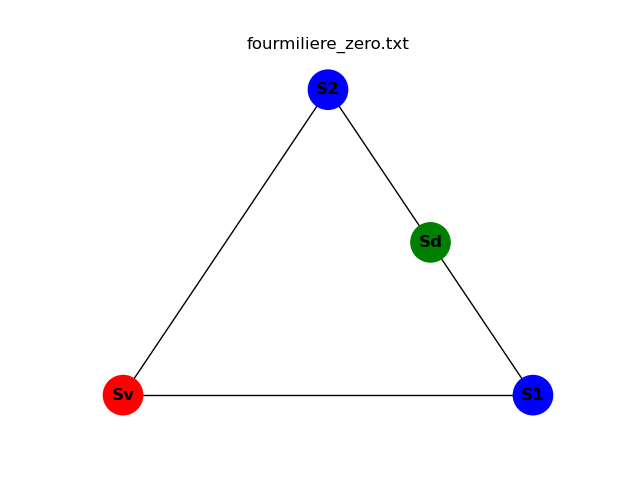
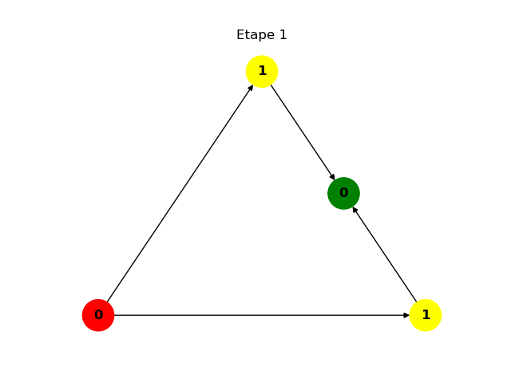

# Une vie de fourmi

## Problématique
### &Eacute;noncé
Une fourmilière est représentée sous forme d'un graphe dont les noeuds sont des salles.
Les individus sont regroupés dans le vestibule et doivent atteindre le dortoir en passant par
des salles intermédiaires pouvant acceuillir chacune un nombre variable de fourmis.

### Exemple
La fourmilière fournie dans le fichier fourmiliere_zero.txt peut se représenter comme suit:

## Solutions
### Intuition
Chaque fois que des individus avancent dans une salle suivante, ils laissent autant de place pour des individus de la salle précédente. Comme les fourmis avancent toutes ensemble à la même vitesse, on implémente un algorithme qui commence par la cellule finale (le dortoir) et remonte par tous les chemins possibles jusqu'à la salle de départ (le vestibule), afin de déplacer les fourmis les plus avancées en premier, pour libérer de la place pour celles qui les suivent.

### Implémentation
Les salles sont représentés par des instances d'une classe Node. La fourmilière est également modélisée sous la forme d'une classe qui liste l'enseble de ses salles sous forme de dictionnaire.   

Nous avons implémenté une fonction récursive qui permet de remonter dans toutes les salles immédiatement précédentes d'une salle donnée (puis les salles précédentes de ses salles précédentes, etc.) et d'en déplacer les fourmis qui peuvent l'être.

La fonction est appliquée à l'ensemnle des salles de la fourmilière, et le programme boucle tant que toutes les fourmis ne sont pas dans le dortoir.

### Exemple 
Le fichier fourmiliere_zero.txt donne une fourmilière simple avec deux salles intermédiaires en parallèle ne pouvant accueillir qu'une fourmi à la fois. La population est composée de deux fourmis.

Les étapes de déplacement sont les suivantes:

## Conclusion
La solution mise en place a permis de résoudre les problèmes qui ont été fournis.

Cependant, nous n'avons pas optimisé l'algorithme afin de minimiser le nombre d'étapes.

Nous ne sommes pas non plus en mesure de garantir que le programme résoud tous les problèmes de fourmilière.